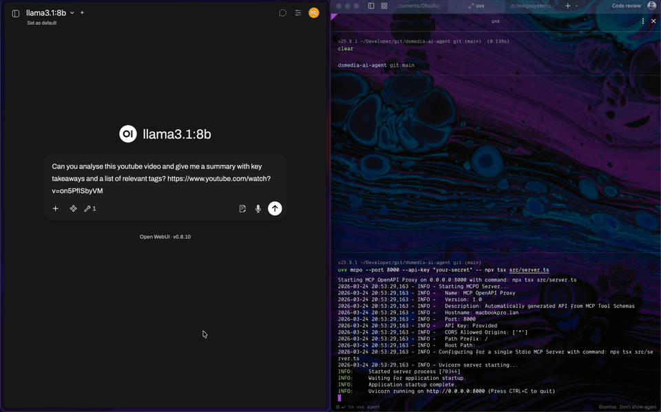
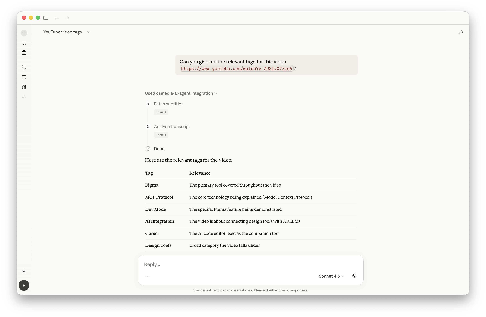

# DS.media AI Agent

A Node.js + TypeScript YouTube ingest pipeline that exposes one shared workflow through four aligned surfaces:

- MCP tools
- CLI commands
- skill manifests and markdown guidance
- configurable Ollama-backed LLM runtime

The repo ingests a YouTube video, produces transcript artifacts, and writes structured JSON analysis keyed by the canonical YouTube video ID.





## What The Pipeline Does

For each video, the pipeline:

1. Resolves the canonical YouTube video ID
2. Downloads audio with `yt-dlp` when needed
3. Prefers YouTube subtitles or auto-captions when available
4. Falls back to Whisper transcription when subtitles are unavailable
5. Sends the transcript to a local Ollama model
6. Writes validated JSON to `data/analysis/<videoId>.json`

For long transcripts, the analysis step now summarizes the transcript in chunks before the final structured JSON pass so smaller local models are less likely to return truncated JSON.

Artifact paths are stable and source-linked:

- `data/audio/<videoId>.mp3`
- `data/descriptions/<videoId>.txt`
- `data/metadata/<videoId>.json`
- `data/notes/<videoId>.md`
- `data/transcripts/<videoId>.txt`
- `data/transcripts/<videoId>*.vtt`
- `data/analysis/<videoId>.json`

When subtitles are available, the pipeline keeps one preferred English `.vtt` variant for the video and removes the rest.

## Requirements

- Node.js
- `yt-dlp`
- `whisper` from `openai-whisper`
- Ollama running locally
- At least one Ollama model installed

Recommended default profile for a 16 GB Apple Silicon machine:

- `balanced` → `llama3.1:8b` (verified locally in this repo)

Other built-in profiles:

- `fast` → `gemma3:4b` (available, not yet locally validated here)
- `quality` → `qwen3:8b` (available, not yet locally validated here)

## Install

Install project dependencies:

```sh
npm install
```

Install external tools:

```sh
brew install yt-dlp
brew install openai-whisper
```

Confirm Ollama is running and has a model:

```sh
ollama list
```

## Configuration

LLM configuration is layered in this order:

1. explicit runtime override
2. environment variables
3. `dsmedia.config.json`
4. built-in defaults

The checked-in project config is:

```json
{
  "llm": {
    "provider": "ollama",
    "baseUrl": "http://localhost:11434",
    "profile": "balanced",
    "temperature": 0.2,
    "structuredOutput": true
  }
}
```

Supported environment variables:

- `DSMEDIA_LLM_PROFILE`
- `DSMEDIA_LLM_MODEL`
- `DSMEDIA_LLM_BASE_URL`
- `DSMEDIA_LLM_TEMPERATURE`
- `DSMEDIA_LLM_NUM_CTX`
- `DSMEDIA_LLM_STRUCTURED_OUTPUT`

Examples:

```sh
DSMEDIA_LLM_PROFILE=fast npm run ingest_video -- 'https://www.youtube.com/watch?v=5MK3SkNST-0'
```

```sh
DSMEDIA_LLM_MODEL=llama3.1:8b npm run ingest_video -- 'https://www.youtube.com/watch?v=5MK3SkNST-0'
```

## CLI

The CLI now uses canonical command names that match the shared runtime registry.

Single video:

```sh
npm run ingest_video -- 'https://www.youtube.com/watch?v=5MK3SkNST-0'
```

Batch ingest:

```sh
npm run ingest_batch -- 'https://www.youtube.com/playlist?list=PLxxxxxxxx'
```

Batch ingest also accepts:

- a channel URL
- a single video URL
- a text file with one URL per line

Compatibility alias for the old single-video entrypoint:

```sh
npm run ingest -- 'https://www.youtube.com/watch?v=5MK3SkNST-0'
```

Direct CLI usage without npm scripts:

```sh
node --import tsx src/cli.ts ingest_video '<youtube-url>'
node --import tsx src/cli.ts ingest_batch '<playlist-url-or-file>'
```

### Step-by-step CLI testing

Each MCP tool can also be tested from the command line with the same canonical name:

```sh
npm run parse_video_id -- '<youtube-url>'
npm run download_audio -- '<youtube-url>'
npm run fetch_description -- '<youtube-url>'
npm run fetch_subtitles -- '<youtube-url>'
npm run transcribe_audio -- '<youtube-url>'
npm run analyse_transcript -- '<youtube-url>' 'data/transcripts/<videoId>.txt'
npm run write_video_summary -- '<youtube-url>'
npm run expand_playlist -- '<playlist-or-channel-url>'
```

Expected behavior by step:

- `parse_video_id` returns the canonical video id plus expected artifact paths.
- `download_audio` writes `data/audio/<videoId>.mp3`.
- `fetch_description` writes `data/descriptions/<videoId>.txt` when a description is available.
- `write_video_summary` writes `data/notes/<videoId>.md`, reusing or generating any missing transcript, analysis, description, and metadata artifacts as needed.
- `fetch_subtitles` writes `data/transcripts/<videoId>.txt` and keeps one preferred English `.vtt` file when subtitles are available.
- `transcribe_audio` produces `data/transcripts/<videoId>.txt`, using subtitles first and Whisper as fallback.
- `analyse_transcript` reads transcript text from the file path you pass and writes `data/analysis/<videoId>.json`, including the cached YouTube description for later reference.
- `expand_playlist` returns a flat list of video ids, URLs, and titles.

## MCP

Start the MCP server:

```sh
npm run server
```

The server communicates over stdio and exposes these tools from the shared registry:

- `parse_video_id`
- `download_audio`
- `fetch_description`
- `write_video_summary`
- `fetch_subtitles`
- `transcribe_audio`
- `analyse_transcript`
- `expand_playlist`

### Test With MCP Inspector

```sh
npx @modelcontextprotocol/inspector node --import tsx src/server.ts
```

### Claude Desktop

Add this to `claude_desktop_config.json` with your absolute repo path:

```json
{
  "mcpServers": {
    "dsmedia-ai-agent": {
      "command": "/opt/homebrew/bin/node",
      "args": [
        "--import",
        "tsx",
        "/absolute/path/to/repo/src/server.ts"
      ]
    }
  }
}
```

Restart Claude Desktop after saving the config.

### Open WebUI

Open WebUI expects an HTTP-facing MCP endpoint. Use `mcpo` as a proxy:

```sh
uvx mcpo --port 8000 --api-key "your-secret" -- node --import tsx src/server.ts
```

Then point Open WebUI at `http://localhost:8000`.

## Skills

The `skill/` directory now contains both human-readable guidance and machine-readable manifests:

- `skill/SKILL.md`
- `skill/SKILL-batch-ingest.md`
- `skill/dsmedia-ai-agent.manifest.json`
- `skill/dsmedia-batch-ingest.manifest.json`
- `formats/video-summary.md`

Portability is handled in layers:

- MCP makes the executable tool interface portable across Claude and other MCP-aware clients.
- Skill manifests make the workflow metadata portable across different AI tool ecosystems.
- Markdown skill files remain the human-facing guidance layer.

This means Claude and other AI tools can share the same runtime workflow even if each tool wraps the guidance differently.

## Output Schema

`data/analysis/<videoId>.json` has this shape:

```json
{
  "id": "string",
  "source_url": "string",
  "description": "string | null",
  "summary": "string",
  "tags": ["string"],
  "key_takeaways": ["string"]
}
```

## Validation And Tests

Type-check:

```sh
npm run typecheck
```

Validate registry and skill-manifest wiring:

```sh
npm run validate
```

Run tests:

```sh
npm test
```
